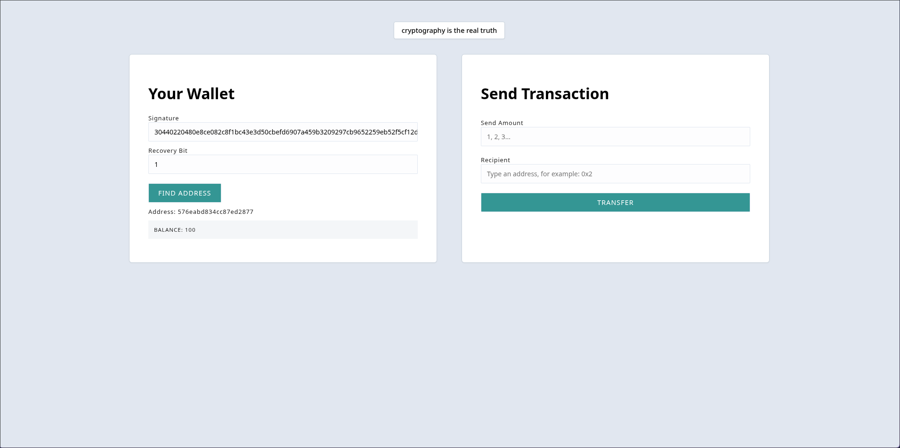
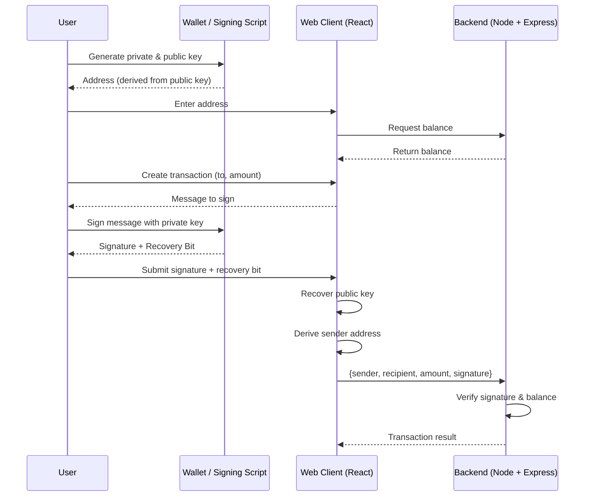

# ECDSA Secure Web Wallet

A **secure client-server web application** demonstrating the use of **Elliptic Curve Digital Signatures (ECDSA)** for authorizing cryptocurrency-like transfers between accounts. This project shows how to implement **public key cryptography** in a practical web application to ensure that only the rightful owner of an account can move funds.

This project was completed as part of the **Alchemy University Blockchain Developer Bootcamp**. It is a **centralized simulation** and does **not implement a blockchain**, but it demonstrates cryptography, signing, and secure transaction validation in a web app.

---

## 🔑 Features

* **Secure transactions:** Users can only transfer funds if they control the private key corresponding to their account.
* **Digital signatures:** Transactions are signed with ECDSA and verified by the server.
* **Ethereum-style addresses:** Account addresses are derived from public keys, similar to Ethereum.
* **Real-time balance updates:** Transfers update balances on the server in real time.
* **Client-server architecture:** React frontend and Node.js backend using Express.

---

## 📂 Project Structure

```
/client      -> React + Vite frontend
/server      -> Node.js + Express backend
/scripts     -> CLI utilities (wallet generation & message signing)
```

---

## 🚀 Demo



---

## 🛠 Installation

### Clone the repository

```bash
git clone https://github.com/0-x-joseph/ecdsa-web-wallet.git
cd ecdsa-web-wallet
```

---

### Client

```bash
cd client
npm install
npm run dev
```

Visit [http://localhost:5173](http://localhost:5173) in your browser.

---

### Server

```bash
cd ../server
npm install
node index
# or, for auto-reloading:
# npm i -g nodemon
# nodemon index
```

Server runs on **port 3042** by default.

---

## 🧭 How to Use the App (End-to-End Flow)

This application follows a **real cryptographic transaction flow**, similar to how wallets work in blockchain systems.

### 1️⃣ Generate a Wallet (Private Key, Public Key, Address)

Navigate to the `scripts` folder and run the wallet generation script:

```bash
cd scripts
node wallet-gen.js
```

This will output:

* A **private key** (keep this secret!)
* A **public key**
* An **Ethereum-style address**

👉 Use the generated **address** in the web app as your wallet address.
👉 The **private key is never sent to the server**.

---

### 2️⃣ Check Your Balance

* Open the web app at `http://localhost:5173`
* Paste your generated **address** into the wallet address input
* Your balance (stored on the server) will be displayed

---

### 3️⃣ Create a Signature for a Transaction

When you want to send funds:

1. Enter:

   * Recipient address
   * Amount
2. The app will construct a **message representing the transaction**
3. Use the signing script to sign that message with your private key

From the `scripts` folder:

```bash
node sign-msg.js
```

You will be prompted for:

* Your **private key** (hidden while typing)
* The **exact message shown in the app**

The script outputs:

* **Signature**
* **Recovery bit**

---

### 4️⃣ Send the Signed Transaction

Back in the web app:

* Paste the **signature**
* Paste the **recovery bit**
* Submit the transaction

✨ **Voilà!**
The server:

* Recovers the public key from the signature
* Derives the sender’s address
* Verifies ownership
* Transfers the funds if the signature is valid

---

## 💡 How It Works (Under the Hood)

1. The client **never sends private keys**.
2. Transactions are signed client-side using ECDSA.
3. The server:

   * Verifies the signature
   * Recovers the public key from `(signature + recovery bit)`
   * Matches the derived address against stored balances
4. Funds move **only if cryptographic ownership is proven**.

## 🧩 Transaction Flow Diagram



---

## ⚡ Key Scripts

### Generate a new account

```js
import * as secp from "ethereum-cryptography/secp256k1.js";
import { toHex } from "ethereum-cryptography/utils.js";
import { keccak256 } from "ethereum-cryptography/keccak.js";

const privateKey = secp.utils.randomPrivateKey();
console.log("Private Key:", toHex(privateKey));

const publicKey = secp.getPublicKey(privateKey);
console.log("Public Key:", toHex(publicKey));

const address = toHex(keccak256(publicKey)).slice(-20);
console.log("Address: " + address);
```

---

### Sign a transaction

```js
import * as secp from "ethereum-cryptography/secp256k1.js";
import { keccak256 } from "ethereum-cryptography/keccak.js";
import { toHex, utf8ToBytes } from "ethereum-cryptography/utils.js";
import promptSync from "prompt-sync";

const prompt = promptSync({ sigint: true }); // allow Ctrl+C

function hashMessage(message) {
  return keccak256(utf8ToBytes(message));
}

async function main() {
  const privateKey = prompt("Enter your private key: ", { echo: "*" });
  const message = prompt("Enter your message: ");

  const [signature, recoveryBit] = await secp.sign(
    hashMessage(message),
    privateKey,
    { recovered: true },
  );

  console.log("\nSignature:", toHex(signature));
  console.log("Recovery Bit:", recoveryBit);
}

main();
```

---

## 🔐 Security Notes

* Private keys **never leave the user’s machine**
* The server relies entirely on **signature verification**
* Replay attacks are possible in this demo (no nonce system)
* This project is **educational**, not production-ready

---

## 🎯 What I Learned

* Implementing **ECDSA signing and verification**
* Recovering public keys from signatures
* Designing a **secure client–server crypto flow**
* Ethereum-style address derivation
* Hands-on cryptography via **Alchemy University**

---

## 📌 Extra Credit / Next Steps

* Add **nonces** to prevent replay attacks
* Build an in-app wallet generator
* Add **transaction history**
* Explore multi-signature wallets
* Connect to a real blockchain backend

---

## 🔗 References

* [Alchemy University Blockchain Developer Bootcamp](https://university.alchemy.com/)
* [Noble secp256k1](https://github.com/paulmillr/noble-secp256k1)
* [Ethereum Cryptography](https://www.npmjs.com/package/ethereum-cryptography)
* [ECDSA Overview](https://en.wikipedia.org/wiki/Elliptic_Curve_Digital_Signature_Algorithm)
